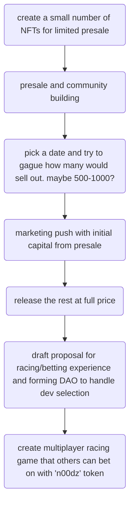
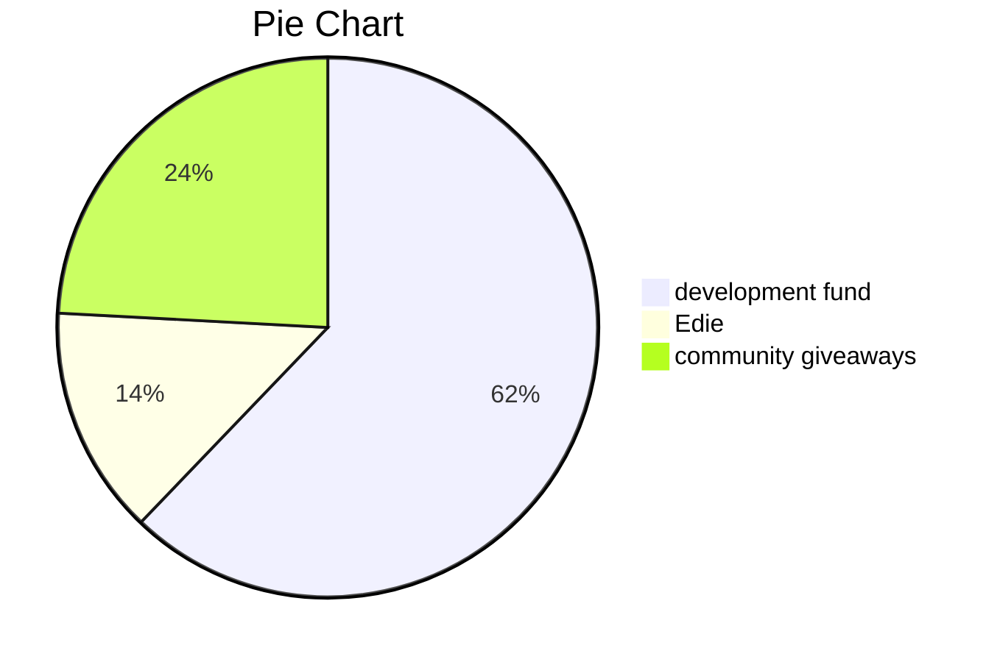

# Dangernoodle

## Stack

* [react-three-next-starter](https://github.com/pmndrs/react-three-next)
* [next-candy-machine](https://github.com/maxwellfortney/next-candy-machine)

## roadmap

## treasury breakdown

